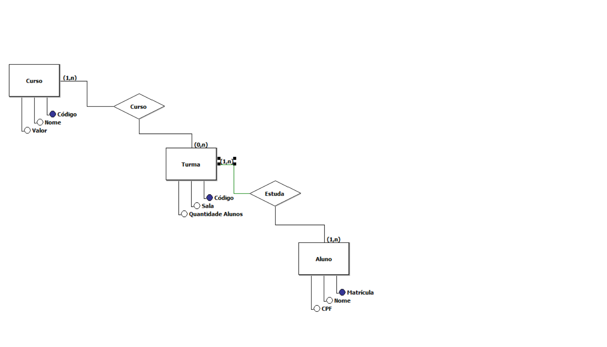

# Trabalho_Individual_4
 
<h1>Existem outras entidades além dessas três?</h1>

Sim, em um colégio é possível encontrarmos outros departamentos que requer escificações, como: funcionários, cantina, disciplinas e etc.

<h1>Quais são os principais campos e tipos?</h1>

Foram utilizados varchar e int

<h1>Como essas entidades estão relacionadas?</h1>

 Em sua maioria 1:N. Na tabela acima é possivel pensar que um curso atende a várias turmas e várias turmas atendem a vários alunos e vice-versa.

